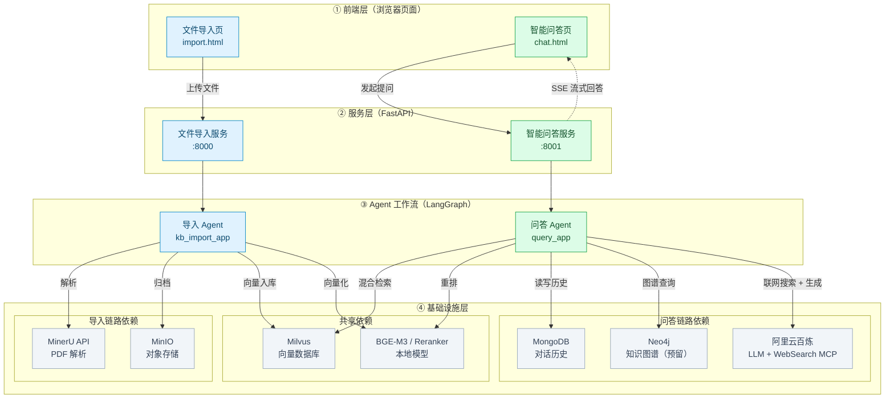
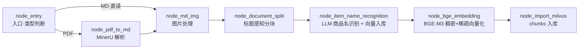
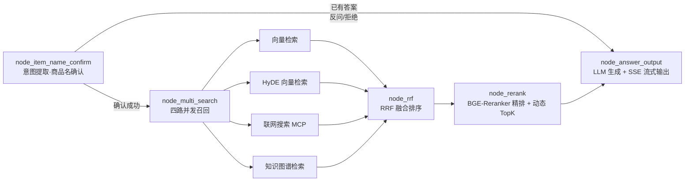

# Multi-Modal RAG 知识库智能问答系统

> 面向电商/产品场景的企业级多模态检索增强生成（RAG）系统：文档自动入库 → 商品级语义检索 → 多路召回融合 → 重排序 → 流式生成回答。
>
> 核心亮点：**LangGraph 双 Agent 流水线** + **BGE-M3 稠密/稀疏混合检索** + **RRF 融合排序** + **BGE-Reranker 精排** + **SSE 流式输出**，并针对「商品/型号级」问答场景做了深度业务定制（商品名识别、确认与反问机制）。

---

## 1. 项目简介

本项目是一套面向**电商/产品知识库**场景的多模态 RAG 系统，包含两条由 LangGraph 编排的 Agent 流水线：

| 流水线 | 服务                             | 端口 | 职责 |
|--------|--------------------------------|------|------|
| **导入链路** | File Import Service            | `8000` | PDF / Markdown 文档 → 解析 → 分块 → 商品名识别 → 向量化 → Milvus 入库 |
| **问答链路** | Query Service（Multi-Modal RAG） | `8001` | 用户提问 → 商品名确认 → 多路召回 → 融合/重排 → LLM 流式生成回答 |

系统以「商品（Item）」为知识组织的核心单元：导入时自动识别文档对应的商品名称并写入向量库，问答时先锁定商品名、再在该商品范围内做精准检索，从根本上解决通用 RAG 在多商品场景下「检索范围过大、答案张冠李戴」的问题。

---

## 2. 核心特性

- **🏭 企业级文档导入流水线**：基于 MinerU 的 PDF → Markdown 深度解析（支持公式/表格/版面还原），Markdown 图片自动提取与路径修复，文档分块（标题感知 + 递归切分 + 短块合并）。
- **🧠 商品名智能识别**：利用 LLM 从文档切片中自动识别商品/型号名称，回填到每个 chunk 并建立商品级索引（Milvus `item_names` 集合），支持幂等覆盖入库。
- **🔍 混合检索（Hybrid Search）**：BGE-M3 同时产出 1024 维稠密向量（语义）与稀疏向量（关键词），Milvus `WeightedRanker` 加权融合（默认 0.8 / 0.2）。
- **🔀 多路召回 + RRF 融合**：向量检索（普通 / HyDE 两种） + 联网搜索（阿里云百炼 WebSearch MCP）+ 知识图谱检索（Neo4j 预留）四路并发召回，RRF 算法无监督融合。
- **🎯 BGE-Reranker 精排 + 动态 TopK**：跨本地/联网异构结果统一重排打分，基于「分数断崖」自动截断，保留语义连续的高相关文档集。
- **💬 流式输出（SSE）**：基于 Server-Sent Events 的流式回答推送，含增量文本、图片 URL、结束事件，前端可实时渲染。
- **🛡️ 任务状态机 + 节点级进度**：导入任务全程可追踪（`pending → processing → completed/failed`），前端可轮询每个节点的完成情况。
- **📑 企业级日志**：loguru 双通道（控制台 + 文件），按天滚动、自动清理，调用位置精准定位。
- **🎨 Prompt 与代码解耦**：全部 Prompt 模板独立存放于 `prompts/`，支持无代码调优。
- **✅ 配置驱动**：全部外部依赖（模型路径、数据库地址、API Key）由 `.env` 管理，零硬编码。

---

## 3. 系统架构

### 3.1 总体架构



### 3.2 知识导入链路（Import Pipeline）



### 3.3 智能问答链路（Query Pipeline）



---

## 4. 技术栈

| 分类 | 技术选型 |
|------|----------|
| Web 框架 | FastAPI + Uvicorn |
| 工作流编排 | LangGraph + LangChain |
| 大模型接入 | 阿里云百炼 DashScope（`qwen-flash` / `qwen3-vl-flash`，OpenAI 兼容协议） |
| 向量模型 | BGE-M3（稠密 1024 维 + 稀疏向量，本地推理，支持 CPU/GPU） |
| 重排序模型 | BGE-Reranker-Large（本地推理） |
| 向量数据库 | Milvus（稠密 HNSW + 稀疏倒排索引，WeightedRanker 混合检索） |
| PDF 解析 | MinerU（OpenXLab API / 本地 magic-pdf） |
| 对话历史 | MongoDB（PyMongo） |
| 对象存储 | MinIO（S3 兼容） |
| 知识图谱 | Neo4j（预留） |
| 联网搜索 | 阿里云百炼 WebSearch（MCP over SSE，openai-agents SDK） |
| 日志 | Loguru（双通道、按天滚动、自动清理） |
| 包管理 | uv（`pyproject.toml` / `uv.lock`） |

---

## 5. 目录结构

```text
multi-modal-rag/
├── app/
│   ├── clients/                    # 外部服务客户端（单例封装）
│   │   ├── milvus_utils.py         # Milvus 连接、混合检索、chunk_id 批量回查
│   │   ├── minio_utils.py          # MinIO 对象存储（自动建桶 + 公网只读策略）
│   │   ├── mongo_history_utils*.py # MongoDB 对话历史读写（含索引、LangChain 互转）
│   │   └── neo4j_utils.py          # Neo4j 客户端（预留）
│   ├── conf/                       # 配置层（dataclass + .env，全项目统一）
│   │   ├── lm_config.py            #   大模型（base_url / api_key / model）
│   │   ├── embedding_config.py     #   BGE-M3（路径 / 设备 / FP16）
│   │   ├── reranker_config.py      #   BGE-Reranker
│   │   ├── milvus_config.py        #   Milvus（URL / 集合名）
│   │   ├── mineru_config.py        #   MinerU（base_url / token）
│   │   ├── minio_config.py         #   MinIO
│   │   └── bailian_mcp_config.py   #   百炼 MCP WebSearch
│   ├── core/
│   │   ├── logger.py               # 企业级日志（双通道 / 滚动 / 位置定位）
│   │   └── load_prompt.py          # Prompt 模板加载器
│   ├── import_process/             # ═══ 导入链路（Agent 1）═══
│   │   ├── agent/
│   │   │   ├── main_graph.py       #   LangGraph 状态图（编译产物 kb_import_app）
│   │   │   ├── state.py            #   图状态定义（TypedDict + 默认状态工厂）
│   │   │   └── nodes/              #   7 个业务节点（入口/PDF解析/图片/分块/识别/向量化/入库）
│   │   ├── api/file_import_service.py  # FastAPI 服务（:8000）
│   │   └── page/import.html        #   文件导入前端页
│   ├── query_process/              # ═══ 问答链路（Agent 2）═══
│   │   ├── agent/
│   │   │   ├── main_graph.py       #   LangGraph 状态图（编译产物 query_app）
│   │   │   ├── state.py            #   图状态定义
│   │   │   └── nodes/              #   商品名确认/向量检索/HyDE/联网/图谱/RRF/重排/生成
│   │   ├── api/query_service.py    #   FastAPI 服务（:8001）
│   │   └── page/chat.html          #   智能问答前端页
│   ├── lm/                         # 模型能力层
│   │   ├── lm_utils.py             #   LLM 客户端（JSON / 非 JSON 模式）
│   │   ├── embedding_utils.py      #   BGE-M3 单例 + 稠密/稀疏向量生成
│   │   └── reranker_utils.py       #   BGE-Reranker 单例
│   ├── tool/                       # 模型下载脚本
│   │   ├── download_bgem3.py       #   BGE-M3 模型下载
│   │   └── download_reranker.py    #   BGE-Reranker 模型下载
│   └── utils/                      # 工具层
│       ├── task_utils.py           #   内存任务状态机（pending→processing→completed/failed）
│       ├── sse_utils.py            #   SSE 队列 / 事件推送（DELTA/IMAGE/FINAL/ERROR）
│       ├── normalize_sparse_vector.py  # 稀疏向量归一化
│       ├── escape_milvus_string_utils.py # Milvus 过滤表达式转义
│       └── ...                     # 路径 / 格式化 / 限流等
├── prompts/                        # ═══ Prompt 模板（与代码解耦）═══
│   ├── answer_out.prompt           #   答案生成主模板
│   ├── hyde_prompt.prompt          #   HyDE 假设文档生成
│   ├── image_summary.prompt        #   图片摘要
│   ├── item_name_recognition.prompt   # 商品名识别
│   ├── product_recognition_system.prompt # 商品识别系统角色
│   └── rewritten_query_and_itemnames.prompt # 问题改写 + 商品名提取
├── test/                           # 冒烟 / 单测脚本
├── doc/                            # 项目文档（占位）
├── pyproject.toml                  # 项目配置 + 依赖（uv 管理）
├── uv.lock
├── .env.example                    # 环境变量模板
└── README.md
```

---

## 6. 快速开始

### 6.1 环境要求

| 依赖 | 版本要求 | 说明 |
|------|----------|------|
| Python | >= 3.11 | 推荐 3.12+ |
| uv | 最新版 | 包管理（备选 Poetry / pip） |
| Milvus | 2.x | 向量数据库（需可达） |
| MongoDB | 4.x+ | 对话历史 |
| MinIO | 最新版 | 对象存储 |
| BGE-M3 / BGE-Reranker 模型 | 本地文件或自动下载 | 见 [6.4 模型准备](#64-模型准备) |
| GPU | 可选 | 无 GPU 时 CPU 推理（需关闭 FP16） |

### 6.2 依赖安装

```bash
# 克隆项目后，使用 uv 同步依赖
uv sync

# 或使用 pip
pip install -r <(uv export --format requirements-txt)
```

### 6.3 环境变量配置

```bash
cp .env.example .env
# 编辑 .env，至少配置以下核心项：
# - OPENAI_API_KEY / OPENAI_BASE_URL（百炼 DashScope 兼容端点）
# - BGE_M3_PATH / BGE_RERANKER_LARGE（本地模型路径）
# - MILVUS_URL / CHUNKS_COLLECTION / ITEM_NAME_COLLECTION
# - MONGO_URL / MONGO_DB_NAME
# - MINIO_ENDPOINT / MINIO_ACCESS_KEY / MINIO_SECRET_KEY / MINIO_BUCKET_NAME
# - MINERU_API_TOKEN / MINERU_BASE_URL（PDF 解析服务）
# - MCP_DASHSCOPE_BASE_URL（联网搜索）
```

### 6.4 模型准备

BGE-M3 与 BGE-Reranker 支持本地文件路径（推荐，`BGE_M3_PATH` / `BGE_RERANKER_LARGE`），也支持直接填模型仓库 ID（`BAAI/bge-m3`）自动下载。项目内置下载脚本：

```bash
python app/tool/download_bgem3.py
python app/tool/download_reranker.py
```

CPU 环境务必保持 `BGE_FP16=0`、`BGE_RERANKER_FP16=0`；GPU 环境可开启 `BGE_DEVICE=cuda:0` 并使用 FP16 加速。

### 6.5 启动服务

**服务一：文件导入服务（:8000）**

```bash
python app/import_process/api/file_import_service.py
# 或
uvicorn app.import_process.api.file_import_service:app --host 0.0.0.0 --port 8000
```

**服务二：智能问答服务（:8001）**

```bash
python app/query_process/api/query_service.py
# 或
uvicorn app.query_process.api.query_service:app --host 0.0.0.0 --port 8001
```

启动后访问：

| 地址 | 说明 |
|------|------|
| `http://localhost:8000/import.html` | 文件导入前端页 |
| `http://localhost:8000/docs` | 导入服务 Swagger 文档 |
| `http://localhost:8001/chat.html` | 智能问答前端页 |
| `http://localhost:8001/docs` | 问答服务 Swagger 文档 |

---

## 7. API 参考

### 7.1 文件导入服务（:8000）

| 方法 | 路径 | 说明 |
|------|------|------|
| GET | `/import.html` | 返回文件导入前端页面 |
| POST | `/upload` | 多文件上传（`multipart/form-data`，字段名 `files`），自动触发导入 Agent 全流程，返回 `task_ids` 列表 |
| GET | `/status/{task_id}` | 查询任务状态（`status` + `done_list` 已完成节点 + `running_list` 运行中节点） |

**POST /upload 响应示例**

```json
{
  "code": 200,
  "message": "Files uploaded successfully, total: 2",
  "task_ids": ["uuid-1", "uuid-2"]
}
```

**GET /status/{task_id} 响应示例**

```json
{
  "code": 200,
  "task_id": "uuid-1",
  "status": "processing",
  "done_list": ["upload_file", "node_entry", "node_pdf_to_md"],
  "running_list": ["node_md_img"]
}
```

### 7.2 智能问答服务（:8001）

| 方法 | 路径 | 说明 |
|------|------|------|
| GET | `/chat.html` | 返回问答前端页面 |
| GET | `/health` | 健康检查 |
| POST | `/query` | 发起问答（支持流式 / 非流式），返回 `session_id` |
| GET | `/stream/{session_id}` | SSE 流式接口（`text/event-stream`） |
| GET | `/history/{session_id}` | 查询会话历史（默认最近 50 条） |
| DELETE | `/history/{session_id}` | 清空会话历史 |

**POST /query 请求体**

```json
{
  "query": "HAK 180 烫金机的操作面板如何设置局部烫金？",
  "session_id": "可选，不传则自动生成",
  "is_stream": true
}
```

**流式事件类型**（SSE）：`delta`（增量文本）→ `image`（图片 URL，可选）→ `final`（完成，含完整答案与图片列表）/ `error`（异常）。

---

## 8. 核心设计详解

### 8.1 LangGraph 双 Agent 架构

两条流水线均基于 LangGraph `StateGraph` 构建，核心设计：

- **状态驱动**：每个节点接收全量 `State`（TypedDict），返回键值对自动合并回状态，实现节点间数据共享；
- **条件路由**：导入链路按文件类型（PDF / MD）动态分支；问答链路按「商品名是否确认」决定直接反问还是继续检索；
- **虚拟节点**：问答链路用无逻辑的 `multi_search` / `join` 虚拟节点组织「并发分叉 → 结果汇聚」，实现四路召回并行执行；
- **编译产物**：`workflow.compile()` 产出可重复调用的 `kb_import_app` / `query_app`，支持 `invoke` / `stream` 两种执行模式。

### 8.2 混合检索（Hybrid Search）

BGE-M3 对同一文本产出两路向量：

| 向量 | 维度 | 语义 | Milvus 索引 | 相似度 |
|------|------|------|-------------|--------|
| 稠密 dense | 1024 | 深层语义 | HNSW（`M=16, efConstruction=200`） | COSINE |
| 稀疏 sparse | 变长 | 关键词/特征 | SPARSE_INVERTED_INDEX（`DAAT_MAXSCORE`） | IP |

检索时通过 `WeightedRanker` 加权融合（默认 `0.8` 稠密 / `0.2` 稀疏，`norm_score=True` 归一化后加权），同时支持 `item_name in [...]` 过滤表达式，实现**商品级精准检索**。

> 为什么 0.8/0.2？稠密向量负责语义召回，稀疏向量负责精确关键词命中——既避免纯语义漂移，也避免纯关键词漏掉同义表达。

### 8.3 RRF + BGE-Reranker 排序链路

召回 → 排序采用「无监督融合 + 监督精排」两级策略：

1. **RRF（Reciprocal Rank Fusion）**：对向量检索（普通 / HyDE）结果按 `score += w * 1/(k + rank)`（`k=60`）融合，不依赖分数尺度，仅凭排名即鲁棒；
2. **BGE-Reranker 精排**：以「改写后问题」为 query，对本地 + 联网异构文档统一打分（`(query, passage)` 配对输入）；
3. **动态 TopK**：基于「分数断崖」检测（相对阈值 25% / 绝对阈值 0.5），自动在 Top1~10 之间截断，避免机械截断引入低相关文档。

### 8.4 商品名识别与确认（业务定制核心）

这是本项目区别于通用 RAG 的关键设计：

- **导入侧（识别）**：LLM 依据「文件标题 + 前 5 个切片内容（截断至 2500 字符）」识别商品/型号名，回填每个 chunk，并生成商品名向量写入 `item_names` 集合（幂等覆盖）；
- **问答侧（确认）**：LLM 从「当前问题 + 最近 10 轮历史」提取 `item_names` 与改写后的独立问题（HyDE 前置）；随后在 Milvus 按相似度对齐：
  - 单个高置信度（>0.85）→ 直接确认，进入检索；
  - 多个高置信度 → 优先精确同名，否则取最高分；
  - 仅中置信度（≥0.6）→ **反问用户**「您是想问以下哪个产品？」；
  - 无匹配 → **拒绝回答**「未找到相关产品」。

这套机制让系统在「问得模糊」时主动澄清，而不是硬答或乱答，显著提升电商客服场景的可用性。

### 8.5 SSE 流式输出

- `POST /query` 设置 `is_stream=true` 时，服务端为 `session_id` 创建队列并立即返回 `session_id`；
- LangGraph 在后台线程流式执行，各节点通过 `push_to_session` 推送事件；
- 前端通过 `GET /stream/{session_id}` 建立 SSE 长连接，接收 `delta → final` 增量渲染；
- 最终事件携带 `image_urls`（从检索文档中正则提取的 Markdown 图片 / 静态图片 URL），前端完成图文渲染。

### 8.6 任务状态机

导入与问答共用内存态任务管理（`task_utils.py`）：

```text
pending ──► processing ──► completed
                │
                └──────────► failed（异常捕获 + 错误日志）
```

- 每个节点执行前标记 `running`、执行后标记 `done`，支持前端轮询展示「第 N 步 / 共 N 步」；
- 节点级异常默认不中断整条链路（降级处理），关键路径异常由外层 `try/except` 统一置 `failed`。

---

## 9. 配置说明

所有配置通过 `.env` 注入，`app/conf/` 下以 dataclass 封装（`lm_config` / `embedding_config` / `milvus_config` 等）。核心配置分组：

| 分组 | 变量 | 说明 |
|------|------|------|
| LLM | `OPENAI_API_KEY` `OPENAI_BASE_URL` `LLM_DEFAULT_MODEL` `VL_MODEL` `LLM_DEFAULT_TEMPERATURE` | 百炼 DashScope 兼容端点；`qwen-flash` 文本、`qwen3-vl-flash` 视觉 |
| Embedding | `BGE_M3_PATH` `BGE_DEVICE` `BGE_FP16` `EMBEDDING_DIM` | BGE-M3 本地路径 / 设备 / 半精度 / 维度（1024） |
| Reranker | `BGE_RERANKER_LARGE` `BGE_RERANKER_DEVICE` `BGE_RERANKER_FP16` | BGE-Reranker 配置 |
| Milvus | `MILVUS_URL` `CHUNKS_COLLECTION` `ITEM_NAME_COLLECTION` | 向量库地址与集合名（切片 / 商品名） |
| MongoDB | `MONGO_URL` `MONGO_DB_NAME` | 对话历史库 |
| MinIO | `MINIO_ENDPOINT` `MINIO_ACCESS_KEY` `MINIO_SECRET_KEY` `MINIO_BUCKET_NAME` `MINIO_IMG_DIR` | 对象存储（原文件归档 + 图片） |
| MinerU | `MINERU_API_TOKEN` `MINERU_BASE_URL` | PDF 深度解析服务 |
| MCP | `MCP_DASHSCOPE_BASE_URL` | 百炼 WebSearch MCP（SSE 端点） |
| 模型缓存 | `MODELSCOPE_CACHE` `HF_HOME` `MODELSCOPE_OFFLINE` | 模型仓库缓存目录 |
| 日志 | `LOG_CONSOLE_ENABLE/LEVEL` `LOG_FILE_ENABLE/LEVEL` `LOG_FILE_RETENTION` | 双通道日志开关与级别 |

---

## 10. 日志体系

基于 **Loguru** 实现（`app/core/logger.py`）：

- **双通道独立级别**：控制台（默认 `INFO`）+ 文件（默认 `INFO`），可分别开关；
- **按天滚动**：`logs/app_YYYYMMDD.log`，`rotation="00:00"`；
- **自动清理**：默认保留 7 天（`LOG_FILE_RETENTION`），防止磁盘占满；
- **调用位置精准定位**：通过 `patch(fix_log_position)` 穿透 Loguru 内部栈帧，日志直接指向业务代码的实际文件/函数/行号；
- **异步安全**：`enqueue=True`，多线程 / 异步场景日志不错乱。

---

## 11. 测试

`test/` 目录提供冒烟与链路测试脚本（按编号执行）：

```text
01-环境与系统变量优先级.py      # 环境变量加载与优先级验证
02-日志测试.py                  # 日志体系验证
03-CUDA测试.py                  # GPU / PyTorch 环境验证
04-test_graph_flow.py           # LangGraph 流程冒烟
05-test-main-graph.py           # 主图（双 Agent）链路验证
```

各 LangGraph 节点自带 `if __name__ == "__main__"` 单元测试入口，可直接运行单文件独立验证节点逻辑（如 `python app/import_process/agent/nodes/node_pdf_to_md.py`）。

---

## 12. 开发规范

- **分层架构**：`api（接口层）→ agent/nodes（工作流层）→ lm/clients（能力层）→ conf（配置层）→ utils（工具层）`，禁止跨层混用；
- **状态即契约**：新增节点必须先扩展 `state.py` 的 TypedDict 定义，节点只消费/产出自定义字段；
- **节点单一职责**：每个 LangGraph 节点拆分为 `step_1 / step_2 / ...` 具名函数，日志贯穿每个 step；
- **配置零硬编码**：外部依赖一律走 `.env` + `app/conf/*.py`，禁止在业务代码中写死地址/密钥；
- **日志贯穿**：所有业务模块统一 `from app.core.logger import logger`，禁止 `print`（调试代码除外）；
- **Prompt 模板化**：新增提示词必须放 `prompts/` 并通过 `load_prompt` 加载；
- **异常降级**：节点级异常优先降级而非中断整条链路，关键路径保留 `exc_info=True` 错误日志。

---

## 13. Docker 部署

> 当前仓库未内置 Dockerfile，以下为推荐部署形态（可按需落地）：

```dockerfile
FROM python:3.12-slim

WORKDIR /app
COPY pyproject.toml uv.lock ./
RUN pip install uv && uv sync --frozen --no-dev

COPY . .
# 模型目录建议挂载外部卷，避免镜像过大
VOLUME ["/app/models", "/app/logs"]

EXPOSE 8000 8001
CMD ["bash", "-c", "uvicorn app.import_process.api.file_import_service:app --host 0.0.0.0 --port 8000 & \
                    uvicorn app.query_process.api.query_service:app --host 0.0.0.0 --port 8001"]
```

生产环境建议：Milvus / MongoDB / MinIO 以独立容器或云托管运行，BGE 系列模型通过外部卷挂载，两个 API 服务各自独立容器 + 反向代理（Nginx / API 网关），并使用 `--workers N` 多进程部署。

---

## 14. 常见问题（FAQ）

**Q1：BGE-M3 模型加载失败？**
检查 `BGE_M3_PATH` 是否指向有效本地目录（或改为仓库 ID `BAAI/bge-m3` 自动下载）；确认 `BGE_DEVICE` 与实际环境匹配；显存不足时减小向量化节点的 `batch_size`（`node_bge_embedding.py` 中默认 5）。

**Q2：CPU 上向量化 / 重排非常慢？**
确认 `BGE_FP16=0` 与 `BGE_RERANKER_FP16=0`（CPU 强制关闭半精度），并合理控制分块数量；生产环境强烈建议 GPU 推理。

**Q3：上传 PDF 后任务一直 processing？**
进入 `logs/app_YYYYMMDD.log` 查看节点进度；最常见原因是 MinerU 解析超时（默认 600s 轮询上限）或 `MINERU_API_TOKEN` 过期。MinIO 上传失败不会中断本地处理链路（仅警告）。

**Q4：检索不到任何结果？**
确认导入时商品名识别成功（`item_names` 集合非空），且提问的 `item_name` 与库内完全一致（系统按 `item_name in [...]` 精确过滤）；可先访问 `http://localhost:8001/chat.html` 用库内已有型号提问验证。

**Q5：`/status/{task_id}` 状态为何存内存？**
任务状态存于进程内存（`task_utils.py`），重启服务即丢失——适合单机/演示；多实例部署需将任务状态迁移到 Redis。

**Q6：Neo4j 未启动会影响流程吗？**
不会。`node_query_kg` 当前为占位实现，图谱检索缺失不影响其余三路召回与最终回答。

---

## License

[MIT](https://opensource.org/licenses/MIT)
